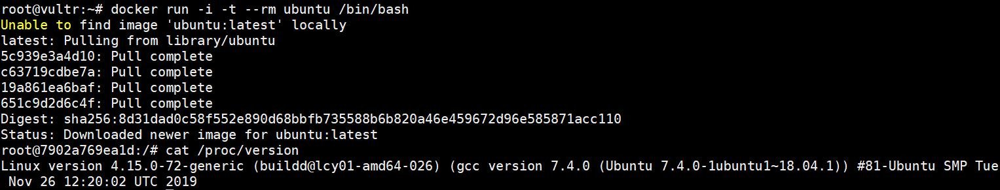
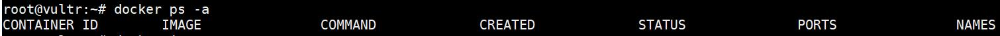
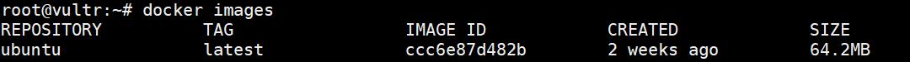
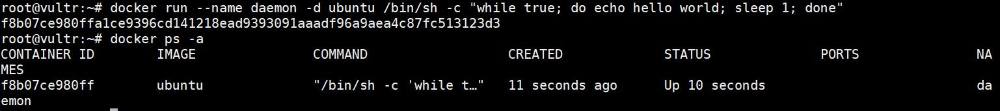
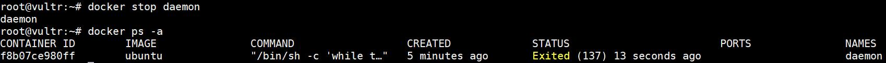
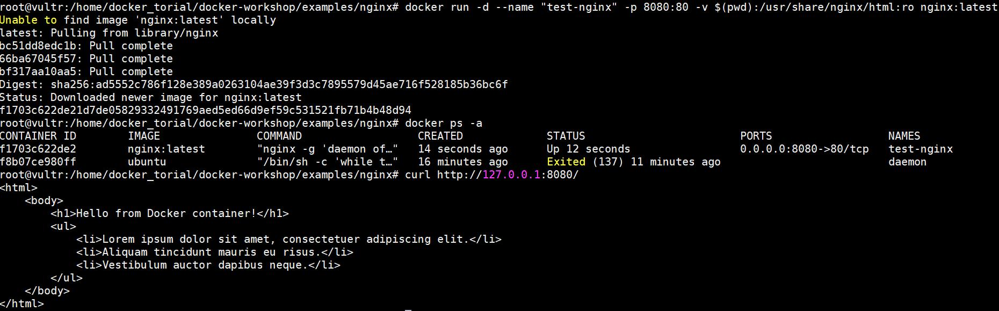
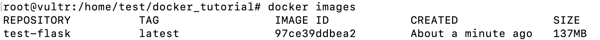
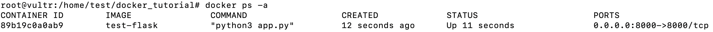
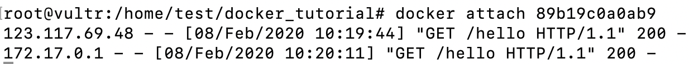

Docker容器和镜像
--
Docker容器用来封装应用、框架、及依赖包，Docker容器与虚拟机(VM)最大的区别在于容器不需要将操作系统（OS）封装进去，所有的Docker容器都共享主机(host)上的操作系统(OS)，这样的优势在于能够减少很多CPU, RAM及存储资源。
Docker容器是通过Docker镜像生成的，它是由Docker镜像创造的一个实例（a running instance that encapsulates required software. Containers are always created from images）  
通过```docker run```启动名为ubuntu镜像的docker容器

docker run首先看主机上是否存在有此镜像（这里的ubuntu），如果没有则从Docker的托管平台下载。其中用到的参数如下：    
-t 在容器内开启一个交互终端  
-i 开启了输入功能  
*-it经常一起使用*  
— rm 当退出容器时容器自动删除  
使用```ctrl+D```退出容器，分别使用```docker ps -a```和```docker images```查看主机的容器和镜像。  
由于容器加了退出自动删除的参数，这里没有正在运行的容器。
  
由于下载了镜像，这里看到存在一个叫ubuntu的镜像。  


再启动ubuntu镜像，并将她命名为daemon并让它在后台运行。此时通过```docker ps -a```会看到一个名为daemon的容器在运行。

可以通过```docker stop daemon```、```docker start daemon```和```docker rm daemon```分别停止、开启、删除容器。


通过以下命令下载nginx并映射端口和挂载存储卷  
```docker run -d --name "test-nginx" -p 8080:80 -v $(pwd):/usr/share/nginx/html:ro nginx:latest```
端口映射和挂载存储卷参数分别为：  
- -p is a ports mapping HOST PORT:CONTAINER PORT.    
- -v is a volume mounting HOST DIRECTORY:CONTAINER DIRECTORY.

Docker volumes are used to persist data from a certain directory or directories of your Docker containers. So your data is not removed when the container stops or is removed.  

Dockerfile
--
Dockerfile是构建docker镜像的配置文件，它可以用来轻易的定义镜像内容。以下是一个例子：  

```
FROM python:2.7
MAINTAINER Angel_Kitty <angelkitty6698@gmail.com>
COPY . /app
WORKDIR /app
RUN pip install -r requirements.txt
EXPOSE 5000
ENTRYPOINT ["python"]
CMD ["app.py"]
```
然后在当前包含dockerfile的地址中运行```docker build -t angelkitty/nginx_web:v1 .```来构建docker镜像，其中-t 是为新镜像设置仓库和名称，其中 angelkitty 为仓库名， nginx_web 为镜像名，:v1为标签（不添加为默认 latest ）。  
构建docker镜像后就可以通过以下命令来启动容器。
```docker run --name nginx_web -d -p 8080:80   angelkitty/nginx_web:v1```  

以下为dockerfile的重点概念和命令简介：
### Build Context  
运行```docker build```时当前文件夹地址被当作*build context*（也可以通过```-f```指定一个特定的地址当作*build context*），*build context*的所有文件将会被传送到*docker daemon*，所有*build context*尽量不包含不必要的文件，可在```docker build```中运行信息中```Sending build context to Docker daemon  187.8MB```查看*build context*文件大小。
### Layer图层
dockerfile中每一个命令都建立一个Layer，此Layer建立在之前的Layer上，也作为接下来Layer的基础
### FROM  
FROM用来指定dockerfile所构建镜像的基础image镜像（basis image)，官方文档推荐使用官方的镜像，并且推荐使用Alpine镜像作为Linux系统基础镜像。
### COPY
COPY采用```COPY [--chown=<user>:<group>] <src>... <dest>```形式，它复制*build context*中的制定文件或文件夹```<src>``到容器中的中的文件或文件夹中```<dest>``，文件夹地址必须以```/```结尾，如果```<dest>```地址存在```build```时会被创建
### RUN
它支持以下两种形式：  
1. ```RUN <command>``` (shell form, the command is run in a shell, which by default is /bin/sh -c on Linux or cmd /S /C on Windows)  
2. ```RUN ["executable", "param1", "param2"] ```(exec form).   
RUN可以使用多次，都在当前layer图层新建layer图层，见以下例子：  

```
from alpine:latest
RUN apk add --no-cache python3-dev \
    && pip3 install --upgrade pip \
    && pip3 install --no-cache-dir pipenv 
WORKDIR /app
COPY . /app
#pipenv lock --requirements > requirements.txt
RUN pip3 --no-cache-dir install -r requirements.txt                                                                          
EXPOSE 8000
ENTRYPOINT  ["python3"]
CMD ["app.py"]
```

### CMD
CMD被用来运行容器中所包含的可执行程序，例如python, Apache等，它有以下几种形式：  
1. ```CMD ["executable","param1","param2"] ```(exec form, this is the preferred form)  
2. ```CMD ["param1","param2"] ```(as default parameters to ENTRYPOINT)  
3. ```CMD command param1 param2``` (shell form)
官方文档推荐使用第1种形式，用来启动可执行程序并进入命令行，例如```CMD ["perl", "-de0"]```， ```CMD ["python"]```， 或者```CMD ["php", "-a"]```， 并且可通过```docker run -it python```启动进入python命令行。  
```ENTRYPOINT```可以和```CMD ["param", "param"]```联合使用。
一个Dockerfile文件里只能有一个```CMD```，

### ENTRYPOINT
```ENTRYPOINT```能够将docker容器配置成一个可执行程序，它支持以下两种形式：  
1. ```ENTRYPOINT ["executable", "param1", "param2"]``` (exec form, preferred)  
2. ```ENTRYPOINT command param1 param2``` (shell form)

当运行```docker run```	时会自动运行```ENTRYPOINT```，如果```docker run```没有传入参数，则会使用```CMD```默认的参数。

```
FROM debian:wheezy
ENTRYPOINT ["/bin/ping"]
CMD ["localhost"]
```

```
$ docker run -it test
PING localhost (127.0.0.1): 48 data bytes
56 bytes from 127.0.0.1: icmp_seq=0 ttl=64 time=0.096 ms
56 bytes from 127.0.0.1: icmp_seq=1 ttl=64 time=0.088 ms
56 bytes from 127.0.0.1: icmp_seq=2 ttl=64 time=0.088 ms
^C--- localhost ping statistics ---
3 packets transmitted, 3 packets received, 0% packet loss
round-trip min/avg/max/stddev = 0.088/0.091/0.096/0.000 ms
```

```
$ docker run -it test google.com
PING google.com (173.194.45.70): 48 data bytes
56 bytes from 173.194.45.70: icmp_seq=0 ttl=55 time=32.583 ms
56 bytes from 173.194.45.70: icmp_seq=2 ttl=55 time=30.327 ms
56 bytes from 173.194.45.70: icmp_seq=4 ttl=55 time=46.379 ms
^C--- google.com ping statistics ---
5 packets transmitted, 3 packets received, 40% packet loss
round-trip min/avg/max/stddev = 30.327/36.430/46.379/7.095 ms
```

**Dockerfile should specify at least one of CMD or ENTRYPOINT commands.**

### VOLUME
由于docker容器的无状态性，容器中不应存储容器运行过程中产生的数据，其产生的数据所在容器的文件夹路径（称为挂载点、或叫卷）可以与宿主机的某个文件夹路径关联起来。
在dockerfile中```VOLUME```配置的挂载点与通过docker run -v配置的挂载点的最大区别是：dockerfile所创建镜像生产容器都包含挂载点，且无法指定主机上对应的目录，主机对应目录都是自动生成的，可通过```docker inspect container_id```查看。若镜像中不存在挂载点路径，创建容器过程中会创建该文件夹路径。例如：
```docker run --name test -it -v /home/xqh/myimage:/data ubuntu /bin/bash```. 

```
FROM ubuntu
MAINTAINER hello1
VOLUME ["/data1","/data2"]
```

```
docker inspect container_id
    "Mounts": [
        {
            "Name": "d411f6b8f17f4418629d4e5a1ab69679dee369b39e13bb68bed77aa4a0d12d21",
            "Source": "/var/lib/docker/volumes/d411f6b8f17f4418629d4e5a1ab69679dee369b39e13bb68bed77aa4a0d12d21/_data",
            "Destination": "/data1",
            "Driver": "local",
            "Mode": "",
            "RW": true
        },
        {
            "Name": "6d3badcf47c4ac5955deda6f6ae56f4aaf1037a871275f46220c14ebd762fc36",
            "Source": "/var/lib/docker/volumes/6d3badcf47c4ac5955deda6f6ae56f4aaf1037a871275f46220c14ebd762fc36/_data",
            "Destination": "/data2",
            "Driver": "local",
            "Mode": "",
            "RW": true
        }
    ],
```

实战
--
在当前文件夹下运行```docker build . -t test-flask```，然后运行```docker images```

使用```docker run -d -p 8000:8000 test-flask```运行容器

用本地```curl 127.0.0.1:8000/hello```和公网IP进行访问都可看到响应（需要使用```docker attach container_id```查看）

## Reference
1. https://hackernoon.com/docker-tutorial-getting-started-with-python-redis-and-nginx-81a9d740d091
2. https://stackoverflow.com/questions/21553353/what-is-the-difference-between-cmd-and-entrypoint-in-a-dockerfile
3. https://blog.csdn.net/geek_xiong/article/details/91995051
4. https://blog.csdn.net/thedarkclouds/article/details/81984943